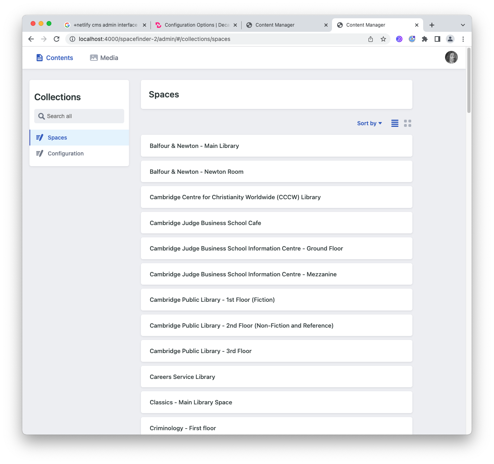

# Intructions for Editing Spaces

[Introduction](#introduction)

[Logging In](#logging-in)

[The Administration Interface](#the-administration-interface)

[Editing Spaces](#editing-spaces)

[Publishing your changes](#publishing-your-changes)

[Performing a full refresh of Spacefinder](#performing-a-full-refresh-of-spacefinder)

## Introduction

> You will need a GitHub account in order to edit the data. If you don’t have one, signup at: <https://github.com/signup>. 
> 
> Please follow the instructions in all the emails that GitHub sends you, including the one asks you to click on a link and enter a code to validate your email address.
>
> After you have verified your email address in GitHub, please contact us with your GitHub username and we will give you access to the spaces data repository.

The admin interface is available at: <https://spacefinder.lib.cam.ac.uk/admin>

> Changes should be available on the site within a few minutes. You likely won’t see them yourself because your browser will be using a locally cached version of the old data. To see your changes, please wait 30 minutes and then [perform a full refresh of Spacefinder](#performing-a-full-refresh-of-spacefinder).

## Logging In

When you visit the page, it will ask you to login. You can do so by clicking on the **Login with GitHub button**.

If you are logged into Github, it should redirect you to the administration interface. If you aren’t logged into Github, it will open a window containing a GitHub login prompt before taking you to the administration interface. The first time you sign in, it will ask if you want to Authorise spacefinder-2. Please do so by clicking on the 'Authorise cambridge-collection' button.

## The Administration Interface

The administration interface presents you with a list of spaces. You can sort this list by space name or modification date through the sort menu.

The format of the list can be changed by pressing the list and panel buttons in the upper right portion of the screen (next to the sort option).

The list view (), as you would expect, displays the items as a compact list.

The panel view () presents the spaces along with their preview image.

## Editing Spaces

Scroll through the list and click on an item to edit it.

The space editing form should be self-explanatory. Some fields allow you to enter text, others are toggle switches and some are dropdown menus. They generally behave as you would expect.

### Space Name (required)

The name of the space

### Description (required)

A space's description.

### Address (optional)

The space's address.

### Building Name (optional)

The building the space is in.

### Floor (optional)

The floor the space is on.

### Location (required)

The location of the space shown on a map. A hollow blue circle marks the space's position. To set (or change) the position of a space, just click on the desired location on the map.

**NB:** It's unlikely that this field will need to be edited on existing spaces since they're already located on the map.

### Access Type (required)

A dropdown menu for indicating whether the space is open to ‘Anyone (public)’, ‘Faculty’, or ‘Members of the University’.

### Restricted Access? (optional)

A toggle that indicates whether the space has any special restrictions. These should be described in the **Restriction** field (below). For example, Music: Faculty Graduate Room has restricted access since it’s open to ‘Faculty of Music Graduate students only’.

### Restriction (optional)

The Restriction field contains a description of any restrictions that might apply to the space, like ‘Faculty of Music Graduate students only’ or ‘No food or drinks allowed.’

### Disabled Access? (optional)

A toggle switch that indicates whether the space has disabled access.

### Website URL (optional)

Contains the full URL to the space's (or building's) website. Please be sure to include the full url, including the `https://` at the start.

### Phone Number (optional)

### Email address (optional)

### Twitter Screen Name (optional)

### Facebook URL (optional)

Please be sure to include the full url, including the `https://` at the start.

### Noise Level (required)

A dropdown menu that lets you select the noise level of the space.

The values, from quietest to loudest, are:

- Strictly silent 
- Whispers
- Background chatter
- Animated discussion
- Music playing

### Facilities (required)

A dropdown menu that lets you select the space's facilities. It is possible to select as many items as are applicable. To remove a facility from a space, click the 'x' to the right of the tag.

The following are available:

- Accessible toilets
- Adjustable furniture
- Attractive views out of the window
- Baby changing facilities
- Bike racks
- Bookable
- Close to a place to take a break
- Close to refreshments
- Computers
- Designated smoking area
- Electronic Legal Deposit
- Food and drink allowed
- Free Wifi
- Gender-neutral toilets
- Individual study space available
- Induction loops
- Laptops allowed
- Large desks
- Natural daylight
- No WiFi
- Outdoor seating
- Parking for blue badge holders
- Phone signal
- Plug sockets
- Prayer room
- Printers and copiers
- Projector
- Toilets nearby
- Wheelchair accessible
- Whiteboards

### AccessAble URL (optional)

Please be sure to include the full url, including the `https://` at the start.

### Work Environment (required)

A dropdown menu that lets you select all the tags that apply to the space. To remove a facility from a space, click the 'x' to the right of the tag.

The following options are available:

- Alone, in private
- In a library
- On a group project
- Where others are working
- With friends

### Atmosphere (required)

A dropdown menu that lets you select all the tags that apply to the space. To remove a facility from a space, click the 'x' to the right of the tag.

The following options are available:

- Cosy
- Disciplined
- Friendly
- Historic
- Inspiring
- Modern
- Relaxed
- Social

### Image (required)

To add or change an image, click on the ‘Choose an image’ button. It will then present you with a preview list of all the images that have been uploaded. If the image you want is online, select it. Otherwise, you can upload a new image by clicking ‘Upload’ and finding and selecting it on your hard drive.

### Term Hours and Out of Term Hours (required)

Edit opening/closing hours as you see fit.

Each day in these list contains an *OPEN* toggle that indicates whether the space is open or closed on that particular day of the week.

Spacefinder will automatically display the relevant hours.

## Publishing your changes

At the top of the page, you will see a status line. If you make any changes to the data in the form, the green text ‘CHANGES SAVED’ will change to ’UNSAVED CHANGES’ in red.

To save our changes on the system, click on the Publish button at the top of the page and, then, the ‘Publish Now’ option that appears.

NB: Any changes that you make to the data should be available on the site within a few minutes. However, you likely won’t see the changes yourself for another 30-60 minutes due to the old data being cached in your browser. To see your changes, please wait 30 minutes and then [perform a full refresh of Spacefinder](#performing-a-full-refresh-of-spacefinder).

## Performing a full refresh of Spacefinder

### Google Chrome

Windows: Press **Ctrl** and click the reload button or press **Ctrl** + **F5**.

Mac: Press **Shift** and click the reload button or press **Command** + **Shift** + **R**.

### Firefox

Windows: Press **Ctrl** + **F5** or **Ctrl** + **Shift** + **R**.

Mac: Press **Shift** and click the reload button or press **Command** + **Shift** + **R**.

### Edge

Windows: Press **Ctrl** and click the reload button or press **Ctrl** + **F5**.

### Safari

Mac: Press **Command** + **Option** + **E**.